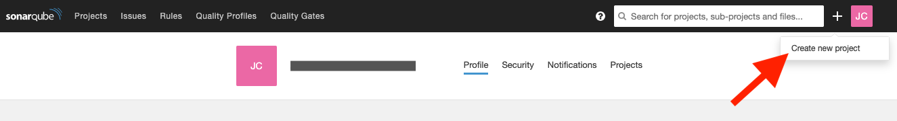
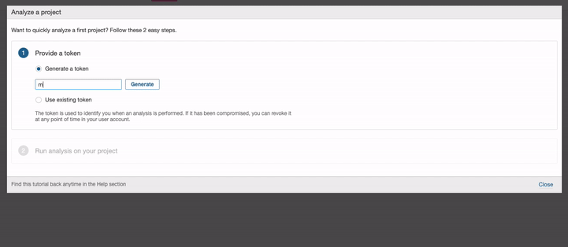
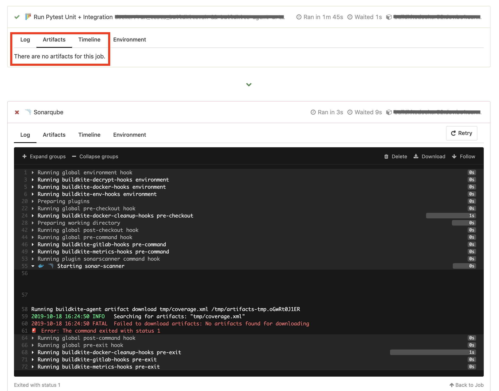
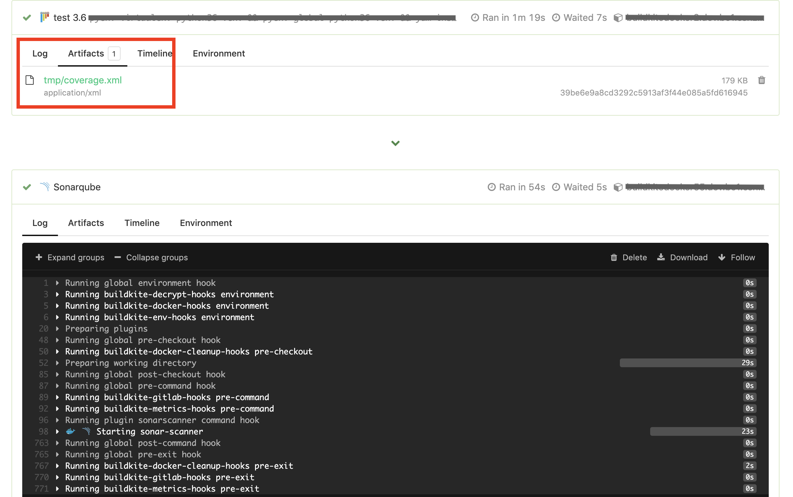

sonarscanner-buildkite-plugin
=============================

[](https://github.com/wayfair-incubator/sonarscanner-buildkite-plugin/actions) [](https://github.com/wayfair-incubator/sonarscanner-buildkite-plugin/actions)  ![Plugin Status](https://img.shields.io/static/v1.svg?label=&message=Buildkite%20Plugin&color=blue&logo=data:image/png;base64,iVBORw0KGgoAAAANSUhEUgAAAGAAAABgCAMAAADVRocKAAAAk1BMVEX///+DrRik1Cb+/vyErhin1yeAqhfJ5n+dzCO50X2VwiC2zna020vg8LSo1i+q1zTN3qL7/fav2UDT4q33++yXuj3z+eLO6IqMuByJsSPM54XX5bWcvUbH5Xrg6sWiwVHB1ovk7cymxFnq8deOtC2xzG7c6L6/1YfU7JbI2pj2+e+jzzPd763K3J3j8ryRtDbY7aOqCe3pAAACTElEQVRoge3Z11KDQBSAYUpItSRqVGwxEVOwxPd/OndhCbA5BTaLM87sueb83+yMStHz3Lhx48bN/5iw+2VjImy0fDvzQiNCLKVrdjn0nq++QwNCLMy+9uOzc2Y59AZBwF4F55NefxxxyxK4aEvI/C7x/QxglrMTBNxVej6V+QNALh+AhkRY5isAsVwBxFWfM/rnLsu/qnwNQIkawBBy/abMawBCaEAQXGFElt/Evo8CIHEEIESWH9XyAAAQACCIH40A8yBwRICARiB5BNAIBKgQ8tLbCZBHgRqBAgWB5wmgQhCAIt7ekTwJ5AQHSGKC1TkgiM7WIs8A0bBvCETR8H7CA4EhIPP9fgPA7AR53u91BBR53+8EKPPdACLvq3wXQC1vH9DytoGjvF0gGo71vE0gCoC8PQDJ2wJEvgfmbQFo3g5A5HNA3K+eL0yBePdO5AtAEAOUoIB4c+ONiHwBZHddjMCB5DUV6yOqfzgBQWCAzMu9ZoAiHgACBpJdmj3SNAdQAgKSXfFQ1gZQz28PlxxQ5tsCIKED+6/qU2tbQBF3lxgwn9YfitsDR0QVmE9D7bHeBNCIEphf63lToEYUAJQ3BxSxlUQGPD3Cr5DmwIGQJ8DypwHqlXX7gec5oMcAXv5OT31OYU6weuM/9tDv/iSwWnJxfghA5s0+QzUCFi828iiwWNvJI4C9PAg8WcwDAPVLYwGwndeAufV8DZB/bm3nK0A3+RyI81tdF3l1gn1neQlM4qnpp+9ms0xP/P8AP/8778aNGzdu/mh+AQp1NCB/JInXAAAAAElFTkSuQmCC)

This plugin performs static code analysis as part of a Buildkite pipeline and reports back to Sonarqube.

WARNING
-------

This plugin is still in **alpha** release publicly and is not ready for prime-time usage.

Usage
-----

You must first create a project in Sonarqube instance. 

Copy the user login token. This must be added to the buildkite pipeline using the environment variable `SONARQUBE_LOGIN` Make sure to store it [securely](https://buildkite.com/docs/pipelines/secrets)!

To ensure the sonar scan step does not fail the pipeline overall (*e.g.* in the case of a Sonarqube outage), make sure to set the [`soft_fail`](https://buildkite.com/docs/pipelines/command-step#soft-fail-attributes) attribute (example below).

```yml
# .buildkite/pipeline.yml
steps:
  - label: ":sonarqube: Sonarqube"
    branches: "master" # only report on the master branch
    plugins:
      - wayfair-incubator/sonarscanner#v0.1.1:
          sonarqube_host: https://sonarqube.example.com
          project_key: sonarqube_project_key
    soft_fail: # Ensures a Sonarqube error does not fail the pipeline
      - exit_status: "*"
```

---

#### Developer/Enterprise Edition only features

The plugin supports paid Sonarqube features, such as enabling scans for a `branch` and/or a `pull request`.

```yml
# .buildkite/pipeline.yml
steps:
  - label: ":sonarqube: Sonarqube"
    plugins:
      - wayfair-incubator/sonarscanner#v0.1.1:
          sonarqube_host: https://sonarqube_enterprise.example.com
          project_key: sonarqube_project_key
          uses_community_edition: false
          enable_branch_scan: true
          enable_pull_request_scan: true
    soft_fail: # Ensures a Sonarqube error does not fail the pipeline
      - exit_status: "*"
```

---

### Language-specific Examples

#### Python

```yml
# .buildkite/pipeline.yml
# Python example
steps:
  - label: "Run unit tests"
    command: test.sh
    artifact_paths: tmp/*coverage-*.xml

  - wait: ~

  - label: ":sonarqube: Sonarqube"
    plugins:
      - wayfair-incubator/sonarscanner#v0.1.1:
          sonarqube_host: https://sonarqube.example.com
          project_key: sonarqube_project_key
          artifacts: tmp/*coverage-*.xml
          additional_flags:
            - -Dsonar.tests=tests
            - -Dsonar.exclusions=test*/**/*
            - -Dsonar.python.coverage.reportPaths=tmp/*coverage-*.xml
    soft_fail: # Ensures a Sonarqube error does not fail the pipeline
      - exit_status: "*"
```

#### .NET Core

```yml
# .buildkite/pipeline.yml
# .NET example
steps:
  - label: "Run unit tests"
    commands:
      - >
        dotnet test --logger:"trx;LogFileName=testresult.xml"
        /p:CollectCoverage=true
        /p:CoverletOutputFormat=opencover
        /p:CoverletOutput="TestResults/opencover.xml"
      - buildkite-agent artifact upload "**/testresult*.xml"
      - buildkite-agent artifact upload "**/opencover*.xml"
    plugins:
      - docker#v3.3.0:
          image: "..."

  - wait: ~

  - label: ":sonarqube: Sonarqube"
    plugins:
      - wayfair-incubator/sonarscanner#v0.1.1:
          sonarqube_host: https://sonarqube.example.com
          project_key: sonarqube_project_key
          is_dotnet: true
          dotnet_build_project: My.App.sln
          artifacts:
            - '**/testresult*.xml'
            - '**/opencover*.xml'
          additional_flags:
            - /s:/root/.dotnet/tools/SonarQube.Analysis.xml
    soft_fail: # Ensures a Sonarqube error does not fail the pipeline
      - exit_status: "*"
```

Coverage reporting
------------------

Sonarscanner does not independently calculate code coverage. Instead, it consumes coverage reports (generally XML files) generated by the test suite for your project. The steps needed to generate coverage reports are language specific. Below are instructions for a few common languages.

In general, unit test steps should be run using either the `docker` or `docker-compose` buildkite plugins. This ensures that the absolute file paths in the generated coverage reports can be set deterministically. When running tests in other agents, you cannot guarantee the file paths, which will result in Sonarqube reporting 0% coverage.

### .NET Core Coverage

This plugin has been tested on projects that use coverlet. This can be added by running `dotnet add package coverlet.msbuild` in the project directory. Refer to the .NET pipeline example above for the specific arguments that should be passed to `dotnet test`. Reports can be accessed using the globs `**/testresult*.xml` and `**/testresult*.xml`.

Configuration
-------------

### Required

#### `project_key` (required, string)

The unique key associated with a Sonarqube project

Example: `sonarqube_project_key`

#### `sonarqube_host` (required, string)

URL of Sonarqube Server where sonarscanner should upload its report.

Example: `https://sonarqube.example.com`

### Optional

#### `additional_flags` (optional, [ string, array ])

Pass additional flags to `sonar-scanner`. Useful for defining additional properties (`-D`). Available properties can be found [here](https://docs.sonarqube.org/latest/analysis/analysis-parameters/). Can also be used to run `sonar-scanner` in debug mode (`-X`\)

Examples:

```yaml
# string
additional_flags: -Dsonar.ws.timeout=120
```

```yaml
# array
additional_flags:
  - -Dsonar.ws.timeout=120
  - -Dsonar.tests=unit_tests,integration_tests
```

#### `artifacts` (optional, [ string, array ])

The artifact glob path to find test and coverage reports that should be passed to Sonarqube. Be sure let Sonarqube know where to find artifacts using the `additional_flags` property. The correct property for your language can be found [here](https://docs.sonarqube.org/latest/analysis/coverage/).

Examples:

```yaml
# string
artifacts: tmp/*coverage-*.xml
```

```yaml
# array
artifacts:
  - tmp/*coverage-*.xml
  - tmp/foo/**/*.html
```

#### `branch_scan_target` (optional, string)

Used when `enable_branch_scan` is set to be `true`. If the scanner analyses this branch, it will perform a standard analysis. Otherwise, it assumes the branch is a feature branch and performs branch analysis.

Default: `master`

#### `dotnet_build_project` (optional, string)

Used only if `is_dotnet: true`. The build project name is passed to `dotnet build`.

Example: `My.App.sln`

#### `enable_branch_scan` (optional, boolean)

If enabled, [Branch analysis](https://docs.sonarqube.org/pages/viewpage.action?pageId=11640256) will be run. This parameter is only supported in the Enterprise trial. PR scans take precedence over branch scans.

Default: `false`

#### `enable_pull_request_scan` (optional, boolean)

If enabled, [Pull Request analysis](https://docs.sonarqube.org/latest/analysis/pull-request/) will be run. This parameter is only supported in the Enterprise trial.

Default: `false`

#### `is_dotnet` (optional, boolean)

If the project being scanned is a `dotnet` project.

Default: `false`

#### `scan_only_if_sources_changed` (optional, boolean)

Only execute the scanner if commit includes changes to files defined in the `sources` argument. Useful for creating pipelines that only respond to changes to specific code in monorepo contexts.

Default: `false`

#### `sources` (optional, string)

Comma-separated paths to directories containing main source files.

Default: `.`

#### `uses_community_edition` (optional, boolean)

If you are using the open source community edition of Sonarqube

Default: `true`

#### `workdir` (optional, string)

Directory where source code should be mounted inside of the docker container. Useful if uploading coverage reports to Sonarqube that contain absolute paths that need to be matched.

Example: `/app`

Common Issues
-------------

### My pipeline is failing with the error `ERROR: sonarqube login not set`

Ensure your pipeline has the environment variable `SONARQUBE_LOGIN` set.

### My pipeline is failing with the error `FATAL  Failed to download artifacts: No artifacts found for downloading`

If the `artifacts` parameter is used, at least one matching artifact from a previous step must be available. Additional information about buildkite artifacts can be found [here](https://buildkite.com/docs/pipelines/artifacts). If you are generating an artifact in a step that uses the `docker-compose` plugin, review the [plugin documentation](https://github.com/buildkite-plugins/docker-compose-buildkite-plugin#artifacts); notably, artifacts must be generated in a directory that is mounted to the host agent.

Failing example: 

Passing example: 

### Sonarqube is reporting 0% coverage, even though sonarscanner parsed a coverage report

Sonarscanner parses the repository's file tree and attempts to match files against entries from the coverage report. Matches only occur when the absolute paths of the files are the same.

If the repository under test is mounted to a custom directory, Sonarscanner will not match the file paths correctly. You may encounter this if unit tests are executed using the `docker-compose-buildkite-plugin` and the code is made available via a volume mount (for example, `- ./:/app`). In such a case, set the `workdir` parameter equal to the root project directory used when generating the coverage report (in the above case, `/app`).

The `workdir` parameter does not need to be set by default, particularly if the coverage report was generated using the `docker-buildkite-plugin`.

Contributing
------------

See the [Contributing Guide](CONTRIBUTING.md) for additional information.

To execute tests locally (requires that `docker` and `docker-compose` are installed):

```bash
bin/execute_tests.sh
```

Credits
-------

This plugin was originally written by [James Curtin](https://github.com/jamescurtin) for Wayfair.
